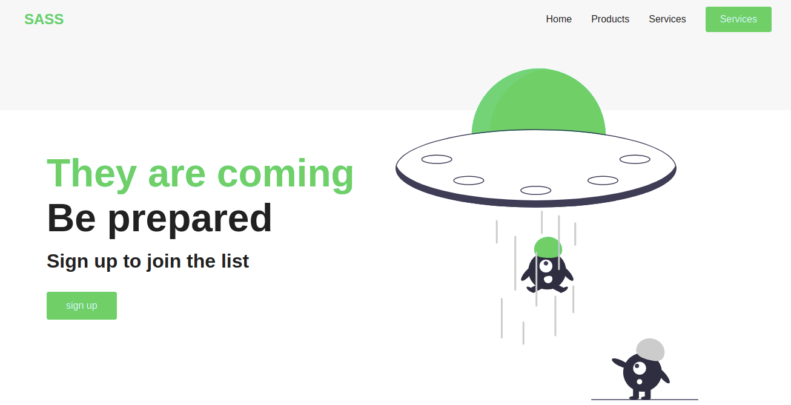

# Building a page with SASS

## Built With

- HTML, CSS, SCSS

## Live Demo

[Live Demo Link](https://shoirata.github.io/sassProject/)

## Getting Started

**This is an example of how you may give instructions on setting up your project locally.**
**Modify this file to match your project, remove sections that don't apply. For example: delete the testing section if the currect project doesn't require testing.**

To get a local copy up and running follow these simple example steps.

### Prerequisites

### Setup

### Install

### Usage

### Run tests

### Deployment

## Authors

👤 **Author2** Shoira

- GitHub: [@shoirata](https://github.com/githubhandle)
- LinkedIn: [LinkedIn](https://linkedin.com/linkedinhandle)
